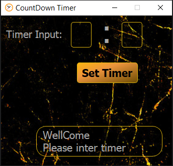

# ⏳ CountDown Timer

A visually appealing and functional countdown timer built with **Python** and **PyQt5**. This application features a modern UI with circular-themed elements and supports customizable timer settings.

---

## 📂 Project Structure

```
CountDown-Timer/
├── CountDown_Timer.py            # Main application script
├── CountDown Timer.ui            # PyQt5 UI layout file
├── circular-clock.png            # Clock design element
├── Black Gold wallpaper.png      # Background wallpaper
├── res.qrc                       # Qt resource configuration
├── res.py                        # Compiled Qt resource file
├── LICENSE                       # License file (MIT)
├── README.md                     # Project documentation
└── screenshots/
    └── screenshot.PNG            # Application screenshot
```

---

## 🖼 Screenshot



---

## 🚀 Getting Started

### Clone the repository

```bash
git clone https://github.com/Ghesmatireza8/CountDown-Timer.git
cd CountDown-Timer
```

### Install dependencies

Make sure you have Python installed. Then install the required package:

```bash
pip install PyQt5
```

### Run the application

```bash
python CountDown_Timer.py
```

---

## ✨ Features

- ⏰ Countdown timer with digital and visual feedback  
- 🎨 Beautiful UI using circular design and custom wallpaper  
- 🖱 Built with PyQt5 and `.ui` layout for easier GUI management  
- 🔊 Custom sound on timer completion (optional for future)

---

## 👤 Author

**Reza Ghesmati**  
📎 [GitHub](https://github.com/Ghesmatireza8)

---

## 📄 License

This project is licensed under the terms of the **MIT License**.  
See the [LICENSE](LICENSE) file for details.
